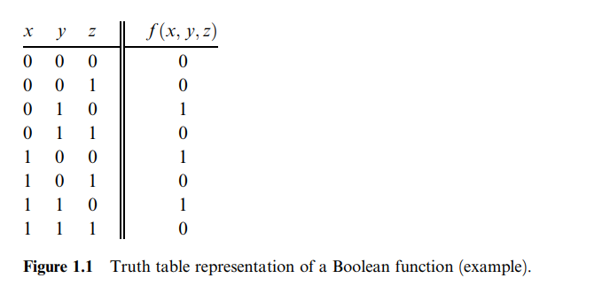
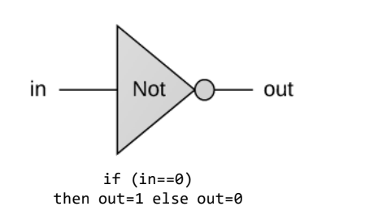
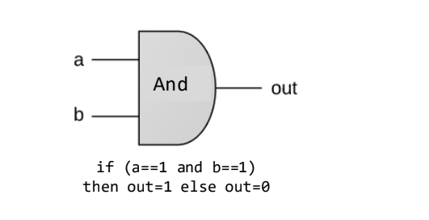
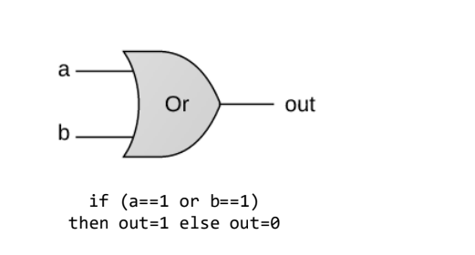
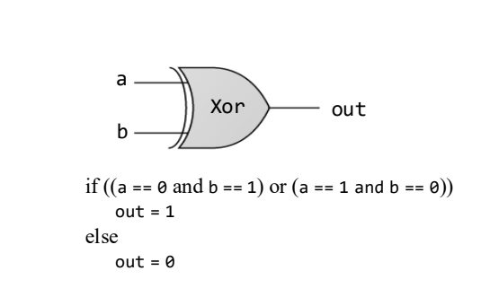
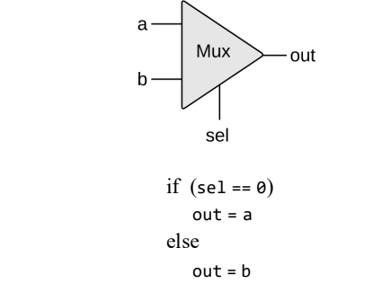
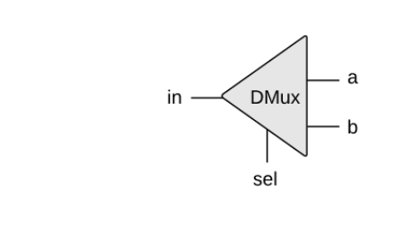
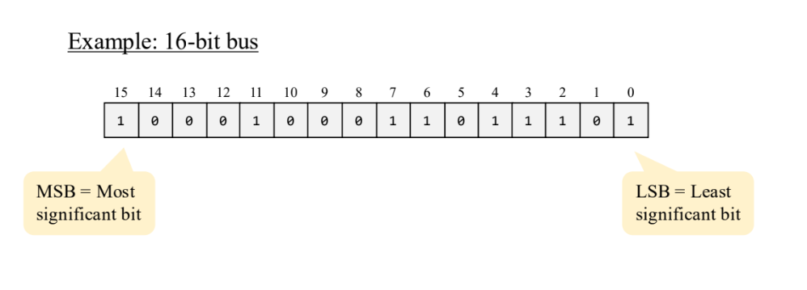
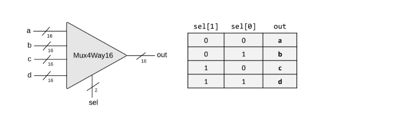
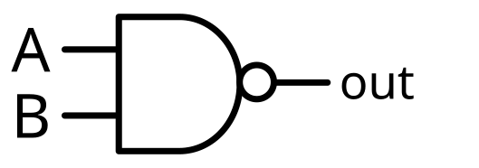

>[!note]
>本章是電腦硬體建構旅程的起點，旨在實踐「**由下而上 (Bottom-up)**」的建構邏輯。數位裝置（如電腦、手機或路由器）雖然功能極其複雜，但其本質皆是由基礎的「邏輯閘」組成。本書的建構哲學是從單一的原始閘——**Nand** 開始，逐步搭建出所有的邏輯單元。本章的最終目標是建立一組標準邏輯閘集，這套工具組將成為第二章與第三章建構處理器 (Processor) 與記憶體 (Memory) 晶片的關鍵基石。

# Boolean Algebra
>[!NOTE]
>布林代數處理二進位值（Binary values），在硬體架構的規範、建構與優化中扮演核心角色。
## 描述布林函數的三種方法：

### Truth Table
>[!WARNING]
>窮舉所有可能的輸入組合及其對應的輸出值。這是最直觀且嚴謹的規範方式。

• 例如：如果有三個變數 x,y,z，真值表就會列出所有 23=8 種可能的 0 與 1 的組合，並在最後一欄顯示函數 f(x,y,z) 的結果。
### Boolean Expressions
>[!WARNING]
>使用布林運算子描述變數關係。我們採用類似算術的標記法

- 除了真值表，布林函數也可以使用布林運算子來對輸入變數進行操作以進行規範。最基本的布林運算子包括 **And** (當且僅當兩者皆為 1 時結果為 1)、**Or** (當其中之一或兩者為 1 時結果為 1) 以及 **Not** (將 0 變為 1，反之亦然)

```
f(x, y, x) = (x AND y) OT (NOT(x) AND z)
```


### Canonical Representation
>[!WARNING]
> 透過觀察真值表中輸出為 1 的行，將該行的輸入組合寫成由 **Literals (變數或其反轉形式)** 組成的 And 項，再將這些 And 項以 Or 連接

- 這是一種將任何布林函數表示為布林表達式的系統化方法。透過分析真值表，我們可以找出所有函數值為 1 的列。對於每一列，我們建構一個將所有輸入變數 And 起來的項（Term），若該變數在該列為 0 則取其反相（Not）。最後，將這些項全部 Or 起來，即可得到該函數的標準表示法

## Boolean Identities
>[!WARNING]
>- Boolean 分配律
>- Boolean 交換律
>- Boolean 結合律 
>- Boolean 狄摩根定律

### Boolean 交換律(Commutative Laws)

```
(x AND y) = (y AND x)
```
```
(x OR y) = (y OR x)
```
### Boolean 結合律(Associative Laws)
```
(x ADN (y AND z)) = ((x ADN y) AND z)
```
```
(x OR (y OR z)) = ((x OR y) OR z)
```
### Boolean 結合律 (Distributive Laws)
```
(x AND (y OR z)) = ((x AND y) OR (x AND z))
```
```
(x OR (y AND z)) = ((x OR y) AND (x OR z))
```
### Boolean 狄摩根定律(De Morgan's Laws)
```
NOT(x AND y) = NOT(x) OR NOT(y)
```
```
NOT(x OR y) = NOT(x) AND NOT(y)
```


# Gate Logic
>[!NOTE]
>「閘 (Gate)」是實現布林函數的物理裝置。在設計過程中，我們必須嚴格區分「介面」與「實現」。
>- Elementary gates (Nand, And, Or, Not, ...)
>- Composite gates (Mux, Adder, ...)

| 視角                                 | 關注點                            | 描述方式                          | 設計對象 (Audience)   |
| ---------------------------------- | ------------------------------ | ----------------------------- | ----------------- |
| **外部介面 (External Interface)**      | 晶片的「功能」，即它對外暴露的輸入與輸出引腳 (Pins)。 | 真值表、布林表達式或文字規格。               | 其他欲調用此晶片作為零件的設計師。 |
| **內部實現 (Internal Implementation)** | 晶片的「構造」，即如何連接更低層級的零件來達成目標。     | 閘圖 (Gate Diagrams) 或 HDL 程式碼。 | 晶片架構師本人。          |
• **原始閘 (Primitive Gates)：** 作為基礎零件的黑盒（如 Nand）。
• **複合閘 (Composite Gates)：** 由原始閘或其他已完成的複合閘互連而成的複雜零件。
## 基本邏輯閘規格與 API 彙整
>[!NOTE]
>六個基本閘規格如下
### NOT Gate
>[!WARNING]
>- 輸入 : `in`
>- 輸出 : `out`

- Function : 
```
If in=0 then out=1  else out=0.
```

| in  | out |
| --- | --- |
| 0   | 1   |
| 1   | 0   |


### AND Gate
>[!WARNING]
>- 輸入 : a, b
>- 輸出 : out

- Function :
```
If a=b=1 then out=1 else out=0
```

| a   | b   | out |
| --- | --- | --- |
| 0   | 0   | 0   |
| 0   | 1   | 0   |
| 1   | 0   | 0   |
| 1   | 1   | 1   |


### OR Gate
> [!WARNING]
> - 輸入 : a, b
> - 輸出 : out

 - Function :
```
If a=b=0 then out=0 else out=1
```

|a|b|out|
|---|---|---|
|0|0|0|
|0|1|1|
|1|0|1|
|1|1|1|



### Xor Gate
> [!WARNING]
> 輸入 : a, b
> 輸出 : out
 
 - Function :
 ```
If a!=b then out=1 else out=0
 ```

|a|b|out|
|---|---|---|
|0|0|0|
|0|1|1|
|1|0|1|
|1|1|0|

### Mux Gate
> [!WARNING]
> - 輸入 : a, b, sel
> - 輸出 : out

 - Function :
 ```
If sel=0 then out=a else out=b
 ```
 
|sel|a|b|out|
|---|---|---|---|
|0|0|0|0|
|0|0|1|0|
|0|1|0|1|
|0|1|1|1|
|1|0|0|0|
|1|0|1|1|
|1|1|0|0|
|1|1|1|1|

### DMux Gate (Demultiplexor)
> [!WARNING]
> - 輸入 : in, sel
> - 輸出 : a, b

 - Function :
 ```
If sel=0 then {a=in, b=0} else {a=0, b=in}
 ```

|in|sel|a|b|
|---|---|---|---|
|0|0|0|0|
|0|1|0|0|
|1|0|1|0|
|1|1|0|1


## 多位元與多路變體 (Multi-Bit & Multi-Way Variants)
>[!NOTE]
>處理匯流排 (Buses) 是現代電腦處理陣列數據（如 16 位元整數）的標準方式。
### 多位元閘 (Multi-Bit Gates)
>[!WARNING]
>- Sometimes we wish to manipulate a sequence of bits as a single entity
>- Such a multi-bit entity is called "bus"



``` C
CHIP Adder3Way {
	IN a[16], b[16], c[16];
	OUT out[16];
	PARTS:
	Adder(a=a , b=b, out=ab);
	Adder(a=ab, b=c, out=out);
}
```

### 多路閘 (Multi-Way Gates)
> [!WARNING]
> 輸入 : a, b, c, d, sel
> 輸出 : out


- Function :
```
If sel=00 then out=a else if sel=01 then out=b else if sel=10 then out=c else if sel=11 then out=d
```



``` C
CHIP Mux4Way16 {
    IN a[2], b[2], c[2], d[2], sel[3];
    OUT out[2];

    PARTS:
    // 第一層選擇：根據 sel 在 (a, b) 和 (c, d) 之間做選擇
    // 如果 sel=0，選 a/c；如果 sel=1，選 b/d
    Mux16(a=a, b=b, sel=sel, out=ab);
    Mux16(a=c, b=d, sel=sel, out=cd);

    // 第二層選擇：根據 sel[4] 在上一層的結果中做選擇
    // 如果 sel[4]=0，選 ab 群組；如果 sel[4]=1，選 cd 群組
    Mux16(a=ab, b=cd, sel=sel[4], out=out);
}
```

# Nand Gate
>[!NOTE]
>Nand 閘（Not-And）在理論與實務上是硬體建構的唯一公理化起點。

- 萬用性證明： 由於 And, Or, Not 都可以僅由 Nand 構成（例如 `x Or y=(x Nand x) Nand (y Nand y)）`，這意味著**任何布林函數都能僅用 Nand 閘實現**。
- 系統架構師的洞察： 除了 Nand 之外，理論上也可以僅用 **Nor** 閘建構完整的電腦。這種萬用性讓電腦科學家能從物理細節（如電力、電路、開關技術）中抽離，將精力集中在邏輯設計上，並深信物理學家與電子工程師能透過各種技術（如矽電晶體、光學或生物機制）實現這些邏輯。



|a|b|Nand(a, b)|
|---|---|---|
|0|0|**1**|
|0|1|**1**|
|1|0|**1**|
|1|1|**0**|
## 實作Universality of Nand
 - NOT Gate
```
Not( x) = x Nand x
```
- AND Gate
```
x And y = Not( x Nand y)
```
- OR Gate
```
x Or y = Not(Not(x) And Not(y))
```