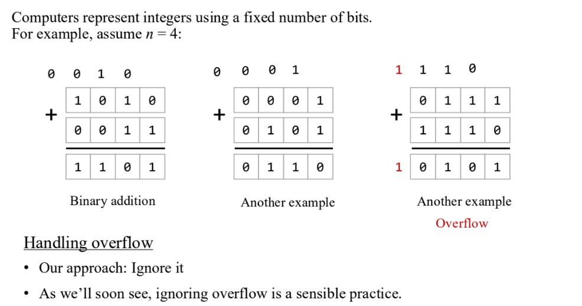
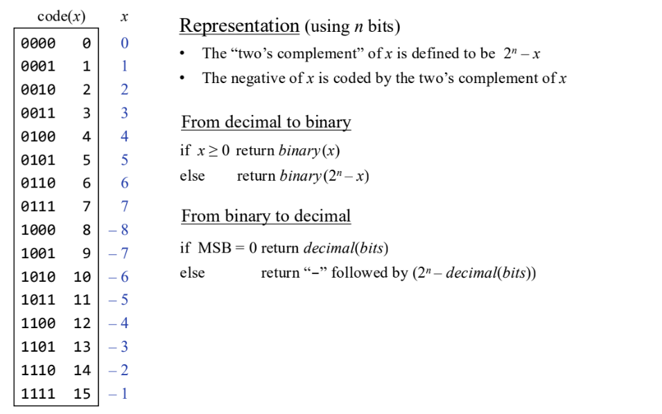
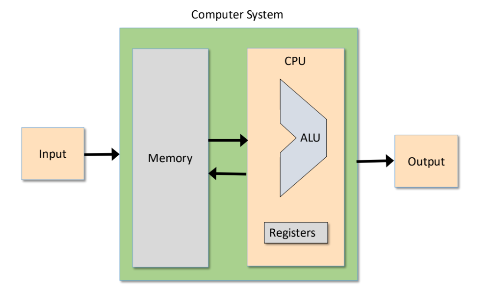
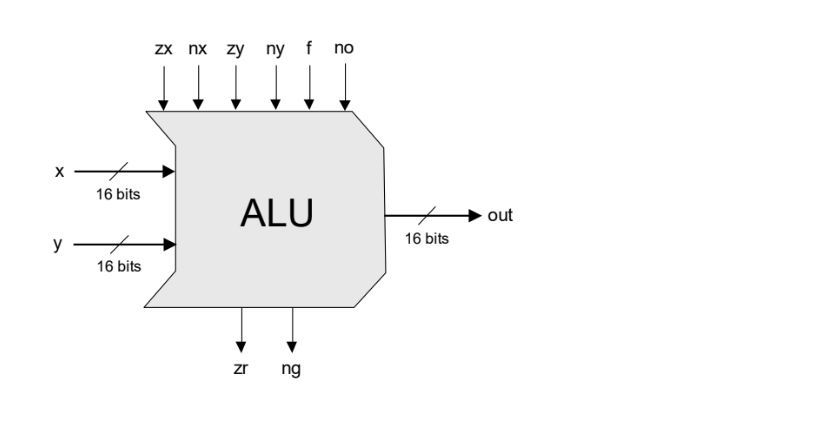
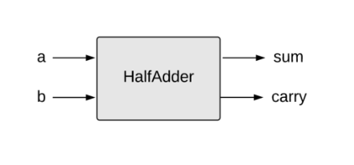
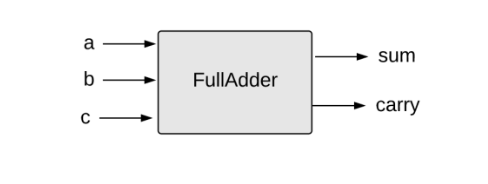
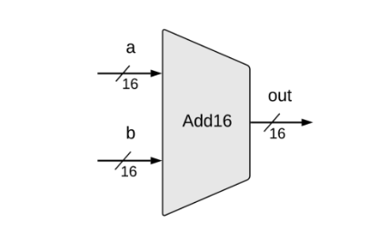
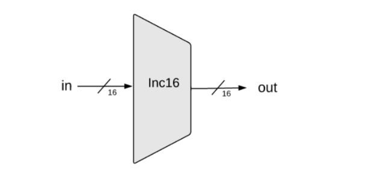

>[!NOTE]
>這章「布林運算」（Boolean Arithmetic）是從基礎邏輯閘邁向實體計算機架構的關鍵轉折。本章的核心目標是利用第一章建立的邏輯閘，來構建能夠處理數字運算的晶片。內容首先介紹二進位系統與「二補數」（Two's Complement）表示法，解決了電腦如何高效存儲與運算有號整數的問題；接著，您將依序實作半加器、全加器與 16 位元加法器，並最終整合這些組件來構建計算機的運算核心——算術邏輯單元（ALU）。這個 Hack ALU 不僅能執行算術加法，還能透過控制位元靈活切換執行邏輯運算（如 And、Or），為後續 CPU 的設計奠定基礎
# 進位制轉換
>[!NOTE]
>為了實現人機互動，電腦必須在十進位與二進位之間快速轉換。

| 2^10     | 2^9     | 2^8     | 2^7     | 2^6    | 2^5    | 2^4    | 2^3   | 2^2   | 2^1   | 2^0   |
| -------- | ------- | ------- | ------- | ------ | ------ | ------ | ----- | ----- | ----- | ----- |
| **1024** | **512** | **256** | **128** | **64** | **32** | **16** | **8** | **4** | **2** | **1** |
# Boolean arithmetic
>[!NOTE]
>說明如何用邏輯閘實現數位加法。

## Addition


## 表達負數-Two’s complement



### 1. 數字的二進位表示 (Representation)

在二補數系統中，正數直接轉換為二進位，而負數 −x 則表示為 2n−x（即總數減去該數）。

• **6 的表示法**： 直接轉換為二進位：**0110**。

• **-2 的表示法**： 在 4 位元系統中 (n=4)，總數為 24=16。 −2 被表示為 16−2=14。 14 的二進位是 **1110**。

### 2. 加法運算過程 (The Addition Process)

電腦使用標準的二進位加法器來執行運算，不需區分正負號。

將兩數垂直相加：

```
    0 1 1 0   (代表 6)
  + 1 1 1 0   (代表 -2)
  ---------
  1 0 1 0 0   (原始運算結果)
  ^
  |
 溢位 (Overflow)
```

詳細位元運算如下：

1. **第 0 位**：0+0=0

2. **第 1 位**：1+1=10 (寫 0 進 1)

3. **第 2 位**：1+1+1(進位)=11 (寫 1 進 1)

4. **第 3 位**：0+1+1(進位)=10 (寫 0 進 1)

5. **第 4 位**：產生的進位 1 即為溢位位元。

6. 處理溢位與結果 (Handling Overflow & Result)

在二補數加法中，對於有限位數的系統（此處為 4 位元），我們**忽略最高位的進位（溢位）**,。

• 原始結果：`1 0100`

• 忽略溢位後：**0100**

# Arithmetic Logic Unit (ALU)
>[!note]
>ALU 的功能是：對兩個 n-bit 輸入值執行指定的函數運算，並輸出一個 n-bit 的結果。



Hack ALU 必須實現一組特定的函數組合，包含：
-  算術函數 (Arithmetic): x+y,x−y,x+1,x−1,y+1,y−1 等。
- 邏輯函數 (Logical): x&y (And), x∣y (Or), !x (Not), 以及關鍵的常數函數 0 與 1。


## The Hack ALU



這四個位元負責在運算前修改輸入值 x 和 y，輸入後會有輸入預處理 (Pre-setting Inputs) : 
-  **zx** (Zero x)：**若 zx = 1，則將** x **設定為 0**。
-  **nx** (Negate x)：**若 nx = 1，則將** x **按位元取反 (Not** x**)**。
	    -  _注意：如果 zx 和 nx 同時為 1，_x _會先變 0，再變 11...1 (即 -1)_。
-  **zy** (Zero y)：**若 zy = 1，則將** y **設定為 0**。
- **ny** (Negate y)：**若 ny = 1，則將** y **按位元取反 (Not** y**)**。

經過上述處理後的 x 和 y，會進入運算階段：
-  **f** (Function)：
    -  **若 f = 1**，計算 x′+y′（算術加法）。
    -  **若 f = 0**，計算 x′ & y′（邏輯 And）。

最後對運算結果（out）進行處理：
-  **no** (Negate output)：**若 no = 1，則將輸出結果按位元取反 (!out)**。

|控制位元|動作 (Action)|
|---|---|
|**zx**|if `zx` then x=0|
|**nx**|if `nx` then x=!x|
|**zy**|if `zy` then y=0|
|**ny**|if `ny` then y=!y|
|**f**|if `f` then out=x+y else out=x & y|
|**no**|if `no` then out=!out|
## Compute

|**zx**|**nx**|**zy**|**ny**|**f**|**no**|**輸出結果 (out)**|**功能描述 (Function)**|
|---|---|---|---|---|---|---|---|
|1|0|1|0|1|0|**0**|常數 0|
|1|1|1|1|1|1|**1**|常數 1|
|1|1|1|0|1|0|**-1**|常數 -1|
|0|0|1|1|0|0|**x**|傳回 x|
|1|1|0|0|0|0|**y**|傳回 y|
|0|0|1|1|0|1|**!x**|x 按位元取反 (Not x)|
|1|1|0|0|0|1|**!y**|y 按位元取反 (Not y)|
|0|0|1|1|1|1|**-x**|x 的負數 (Negate x)|
|1|1|0|0|1|1|**-y**|y 的負數 (Negate y)|
|0|1|1|1|1|1|**x+1**|x 加 1 (Increment x)|
|1|1|0|1|1|1|**y+1**|y 加 1 (Increment y)|
|0|0|1|1|1|0|**x-1**|x 減 1 (Decrement x)|
|1|1|0|0|1|0|**y-1**|y 減 1 (Decrement y)|
|0|0|0|0|1|0|**x+y**|x 加 y (Add)|
|0|1|0|0|1|1|**x-y**|x 減 y (Subtract)|
|0|0|0|1|1|1|**y-x**|y 減 x (Subtract)|
|0|0|0|0|0|0|**x&y**|x 與 y (Bitwise And)|
|0|1|0|1|0|1|**x\|y**|x 或 y (Bitwise Or)|

# Project 2
>[!NOTE]
Given: All the chips built in Project 1
Build the chips:
> - HalfAdder
> - FullAdder
> - Add16
> - Inc16
> - ALU

## Half Adder
>[!WARNING]
>處理兩個位元 a,b 相加，輸出 `sum` 與 `carry`。



|**a**|**b**|**sum**|**carry**|
|---|---|---|---|
|0|0|**0**|**0**|
|0|1|**1**|**0**|
|1|0|**1**|**0**|
|1|1|**0**|**1**|

- **輸入 (Inputs)**：`a` 與 `b` 是要相加的兩個位元。
- **輸出 (Outputs)**：
    -  **sum**：相加後的總和位元（即 a+b 的個位數）。
    - **carry**：進位位元。當 1+1=2（二進位的 `10`）時，sum 為 0，並產生進位 carry 為 1。


``` C
CHIP HalfAdder {
    IN a, b;    // 1-bit inputs
    OUT sum,    // Right bit of a + b 
        carry;  // Left bit of a + b

    PARTS:
    //// Replace this comment with your code.
    Xor(a=a , b=b , out=sum );
    And(a=a , b=b , out=carry );
}
```


## Full Adder
>[!warning]
>處理三個位元相加（a,b 以及來自低位元的進位 `c`）。



| **a** | **b** | **c** | **sum** | **carry** |
| ----- | ----- | ----- | ------- | --------- |
| 0     | 0     | 0     | **0**   | **0**     |
| 0     | 0     | 1     | **1**   | **0**     |
| 0     | 1     | 0     | **1**   | **0**     |
| 0     | 1     | 1     | **0**   | **1**     |
| 1     | 0     | 0     | **1**   | **0**     |
| 1     | 0     | 1     | **0**   | **1**     |
| 1     | 1     | 0     | **0**   | **1**     |
| 1     | 1     | 1     | **1**   | **1**     |
全加器是用來處理多位元加法的關鍵組件，它比半加器多了一個輸入：

- **輸入 (Inputs)**：
    - **a, b**：目前位元要相加的兩個數值。
    - **c**：來自低一位的**進位 (carry in)**。
- **輸出 (Outputs)**：
    - **sum**：三個位元相加後的總和（即 a+b+c 的個位數）。
    - **carry**：進位輸出（即 a+b+c 是否產生進位到下一位）。
運算範例
- **0 + 1 + 1 = 2** (二進位 10) → sum=0, carry=1
- **1 + 1 + 1 = 3** (二進位 11) → sum=1, carry=1

``` C
CHIP FullAdder {
    IN a, b, c;  // 1-bit inputs
    OUT sum,     // Right bit of a + b + c
        carry;   // Left bit of a + b + c

    PARTS:
    //// Replace this comment with your code.

    // Xor(a=a , b=b , out=temp1 );
    // Xor(a=temp1 , b=c , out=sum );
    Xor(a=a , b=b , out=sum1 );
    And(a=a , b=b , out=carry1 );
    
    Xor(a=sum1 , b=c , out=sum );
    And(a=sum1 , b=c , out=carry2 );

    Or(a=carry1 , b=carry2 , out=carry );

}
```


## Add16
>[!warning]
>將全加器串聯，處理兩個 16-bit 數值的加法。




``` C
CHIP Add16 {
    IN a[16], b[16] ;
    OUT out[16], carry[16];

    PARTS:
    //// Replace this comment with your code.
    HalfAdder(a=a[0] , b=b[0] , sum=out[0], carry=carry0);

    FullAdder(a=a[1] , b=b[1], c=carry0 , sum=out[1] , carry=carry1 );
    FullAdder(a=a[2] , b=b[2], c=carry1 , sum=out[2] , carry=carry2 );
    FullAdder(a=a[3] , b=b[3], c=carry2 , sum=out[3] , carry=carry3 );
    FullAdder(a=a[4] , b=b[4], c=carry3 , sum=out[4] , carry=carry4 );
    FullAdder(a=a[5] , b=b[5], c=carry4 , sum=out[5] , carry=carry5 );
    FullAdder(a=a[6] , b=b[6], c=carry5 , sum=out[6] , carry=carry6 );
    FullAdder(a=a[7] , b=b[7], c=carry6 , sum=out[7] , carry=carry7 );
    FullAdder(a=a[8] , b=b[8], c=carry7 , sum=out[8] , carry=carry8 );
    FullAdder(a=a[9] , b=b[9], c=carry8 , sum=out[9] , carry=carry9 );
    FullAdder(a=a[10] , b=b[10], c=carry9 , sum=out[10] , carry=carry10 );
    FullAdder(a=a[11] , b=b[11], c=carry10 , sum=out[11] , carry=carry11 );
    FullAdder(a=a[12] , b=b[12], c=carry11 , sum=out[12] , carry=carry12 );
    FullAdder(a=a[13] , b=b[13], c=carry12 , sum=out[13] , carry=carry13 );
    FullAdder(a=a[14] , b=b[14], c=carry13 , sum=out[14] , carry=carry14 );
    FullAdder(a=a[15] , b=b[15], c=carry14 , sum=out[15] , carry=carry15 );
}
```

## Inc16



``` C
CHIP Inc16 {
    IN in[16];
    OUT out[16];
    
    PARTS:
    //// Replace this comment with your code.
    Add16(a=in, b[0]=true, b[1..15]=false, out=out);
}
```
## ALU


