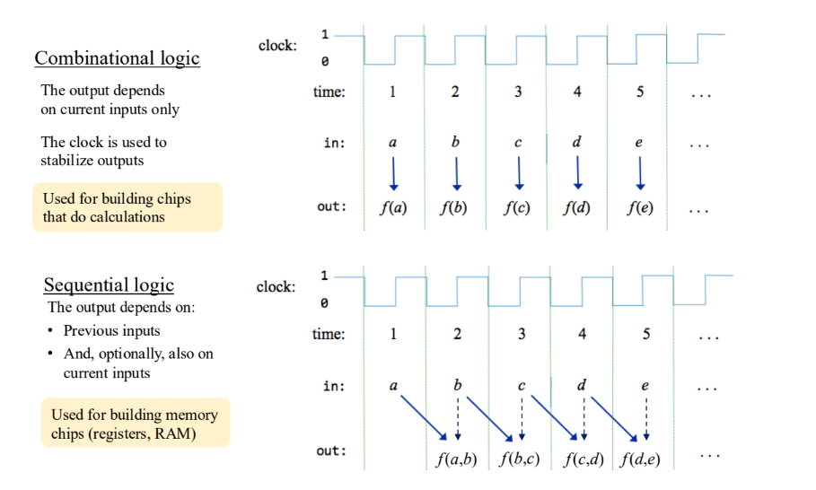
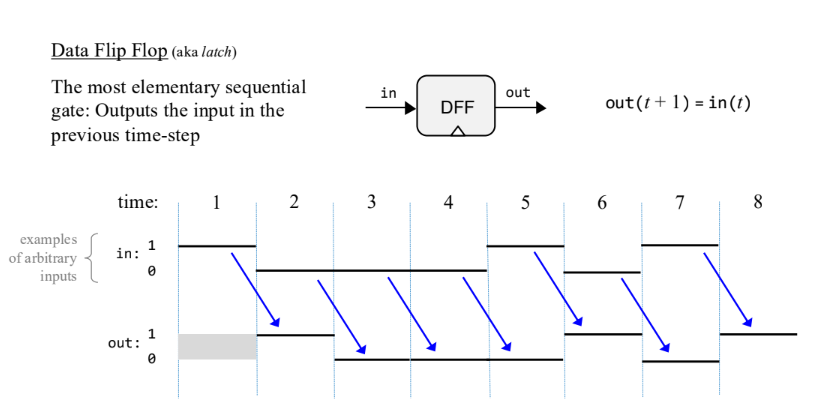
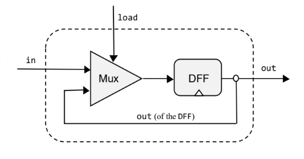
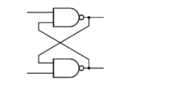
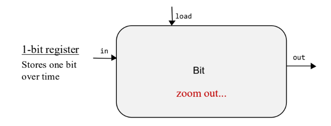
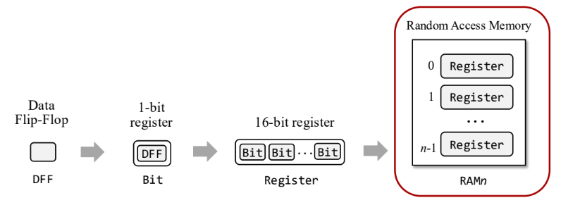
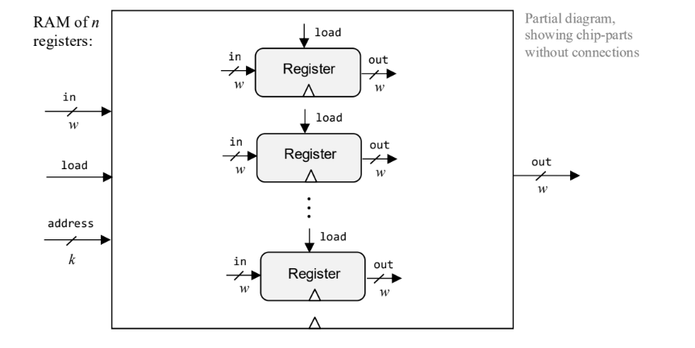

>[!note]
>本章介紹如何引入**時脈 (Clock)** 與**時序邏輯 (Sequential Logic)**，利用基礎的 **Data Flip-Flop (DFF)** 元件逐步構建出**暫存器 (Registers)**、**隨機存取記憶體 (RAM)** 與**程式計數器 (PC)**，賦予電腦記憶數據與追蹤指令位址的能力。

## Combinational logic與Sequential Logic
>[!NOTE]
>**組合邏輯 (Combinational Logic)** 與 **時序邏輯 (Sequential Logic)** 是數位邏輯中的兩大核心類型，它們的主要區別在於「時間」與「狀態」的角色。

1. Combinational Logic (組合邏輯)
	- 核心定義： 晶片的輸出**僅取決於當前的輸入 (Current inputs only)**。
	- 時間特性： 被稱為「與時間無關的邏輯 (Time-independent logic)」。我們假設輸入是固定的，並且輸出是立即（或在忽略物理延遲的抽象層面上）產生的。
	- 用途：主要用於執行運算或處理數據（例如加法、邏輯運算）。
	- 代表元件：ALU (算術邏輯單元) 是這類邏輯的頂層晶片。
2. Sequential Logic (時序邏輯)
	- 核心定義： 晶片的輸出不僅取決於當前輸入，還取決於之前的輸入 (Previous inputs)。這意味著它具有「狀態 (State)」。
	- 時間特性： 這是「基於時間的 (Time-based)」邏輯。為了處理物理時間的延遲並保持狀態穩定，必須引入 時脈 (Clock) 將時間劃分為離散的週期 (Discrete time intervals)。
	- 用途： 用於儲存數據、記憶狀態，以及控制指令執行的順序。
	- 代表元件：
		- Data Flip-Flop (DFF)： 最基本的時序邏輯元件，負責輸出「上一個時間週期」的輸入值。
		- 記憶體單元： 暫存器 (Registers)、RAM、程式計數器 (Counter)。

|特性|組合邏輯 (Combinational Logic)|時序邏輯 (Sequential Logic)|
|---|---|---|
|**輸出依賴**|僅依賴「當前」輸入|依賴「過去」輸入與當前輸入|
|**時間觀念**|與時間無關 (Time-independent)|基於時間 (Time-based)，需要時脈 (Clock)|
|**功能**|計算 (Calculation)|記憶 (Memory) 與 狀態保存|
|**核心元件**|Logic Gates (Nand, And...), ALU|DFF, Registers, RAM|




## Data Flip-Flop (DFF)
>[!NOTE]
>Data Flip-Flop (DFF) 是時序邏輯中最基礎的元件，也是所有記憶體晶片的根本建材。

>The most elementary sequential gate: Outputs the input in the previous time-step



```
out(t + 1) = in(t)
```

- DFF 的運作緊密依賴於時脈 (Clock)。它在每個時鐘週期（Tick-Tock）結束時，捕捉當前的輸入值，並在下一個週期將其輸出。
- DFF 是唯一直接使用時脈訊號的記憶體元件。所有更高階的記憶體晶片（如 Bit, Register **RAM**, PC）都是基於 DFF 構建而成的
## 1-Bit register
>[!NOTE]
>是記憶體系統中最基本的儲存單元，它解決了單純使用 DFF 無法長久保存數據的問題，他能夠長時間儲存 1 個位元的資訊，直到我們明確指示它改變為止。




- Behavior
	- 載入 (Load, load=1)： 暫存器接受新的輸入值。下一時刻的輸出將等於當前的輸入值 (out(t+1)=in(t))。
	- 保持 (Store, load=0)： 暫存器忽略新的輸入，保持原有的數值。下一時刻的輸出將等於當前的輸出值 (out(t+1)=out(t))。

``` C
if load(t):
	out(t + 1) = in(t)
else
	out(t + 1) = out(t)
```

這個結構引入了兩個關鍵訊號：
- **`in`**：想寫入的新數據。
- **`load` (控制位元)**：
    - 如果 `load == 1`：允許寫入（Mux 選擇 `in`）。
    - 如果 `load == 0`：保持原值（Mux 選擇 **舊的輸出**）。
### 運作流程
1. Mux 的選擇：
    - Mux 的輸入 A (0) 接的是 **DFF 自己的輸出 (Feedback)**。
    - Mux 的輸入 B (1) 接的是 **外部輸入 (`in`)**。
    - Mux 的選擇端 (`sel`) 接的是 **`load`**。
2. DFF 的輸入：
    - DFF 的輸入端接的是 **Mux 的輸出**。
### DFF implementation



- A DFF gate can be built by connecting Nand gates using
feedback loops
- The resulting implementation is elegant, yet intricate
- Instead, we’ll use a built-in DFF implementation:

``` C
CHIP DFF {
	IN in;
	OUT out;
	BUILTIN DFF;
	CLOCKED in;
}
```


### 1-Bit register API



$$Out(t+1) = \begin{cases} in(t) & \text{if } load(t) = 1 \\ out(t) & \text{if } load(t) = 0 \end{cases}$$
1. Bit (晶片本身)
	- 是什麼：這就是那個 「容器」 或 「記憶體單元」。
	- 功能：它能「記住」一個 0 或 1，直到你叫它改變為止。
2. in (輸入資料)
	- 是什麼：這是 「打算寫入的新數值」。
	- 功能：它一直在門口排隊，等著被存進去。
	- 重點：只要門沒開（load 沒允許），不管 in 怎麼變，盒子裡的東西都不會變。
3. load (寫入控制位元) ★最重要
	-  是什麼：這是 「決定是否更新」的開關（Write Enable）。
	-  功能：
		- 當 load = 1 (寫入模式)：打開盒子，把 in (新分數) 放進去，丟掉舊的。
		- 當 load = 0 (保持模式)：鎖住盒子。不管 in 是多少，盒子裡都 維持上一次的值 不變。
4. out (輸出資料)
	- 是什麼：這是 「目前盒子裡存的值」。
	- 功能：它總是顯示 上一個時間點 存進去的東西。
	- 重點：電腦的其他部分（如 ALU）是讀取這裡的值來做運算。

## Memory Units
>[!NOTE]
>，記憶體單元 (Memory Units) 是電腦中負責**維持狀態 (maintain state)** 與**儲存數據**的晶片。它們是基於時序邏輯 (Sequential Logic) 建構的，這意味著它們依賴**時脈 (Clock)** 來同步並「記住」過去的輸入

- 暫存器 (Registers) : 是記憶體的最基本單元，負責儲存數據。
- 多位元暫存器 (Register): 是由多個 1-Bit Register 並聯組成，所有位元共用同一個 `load` 訊號，能夠同時讀寫一個字組
- RAM : 全名是 Random Access Memory (隨機存取記憶體)，無論存取哪一個記憶體位址（無論是第 1 個還是第 1000 個），所需的時間都是相同且即時的。
### From DFF to RAM


### RAM Abstraction and Implementation



RAM 的介面包含 `in` (輸入數據)、`load` (寫入控制)、`address` (位址)、`out` (輸出數據)
- 讀取 (Read)： 將 address 設定為 i，晶片的 out 腳位就會輸出 RAM[i] 的值。這是一個組合邏輯操作，輸出會立即反應。
- 寫入 (Write)： 將 address 設定為 i，in 設定為欲寫入的值 v，並將 load 設為 1。在下一個時脈週期開始時，RAM[i] 的值就會變成 v。若 load 為 0，則記憶體狀態保持不變。
RAM 實作是從基本單位開始，層層堆疊：
1. RAM8：使用 8 個 16-bit Register 構成。
2. RAM64： 使用 8 個 RAM8 構成。
3. RAM512： 使用 8 個 RAM64 構成，以此類推至 RAM16K
Addressing Logic為了實現「直接存取」，我們不移動數據，而是透過邏輯閘「導向」訊號：
- 讀取 (Reading) - 使用 Mux： 利用 Multiplexer (Mux) 來選擇要輸出哪一個暫存器的值。例如在 RAM8 中，使用一個 8-way Mux，根據 address 選擇 8 個暫存器中的哪一個輸出連接到 RAM 的 out。
- 寫入 (Writing) - 使用 DMux： 利用 Demultiplexer (DMux) 來導向 load 訊號。load 訊號只會被傳送到被 address 選中的那個暫存器（使其 load=1 進行更新），其他未選中的暫存器則接收到 load=0（保持原值）
# Project 3


