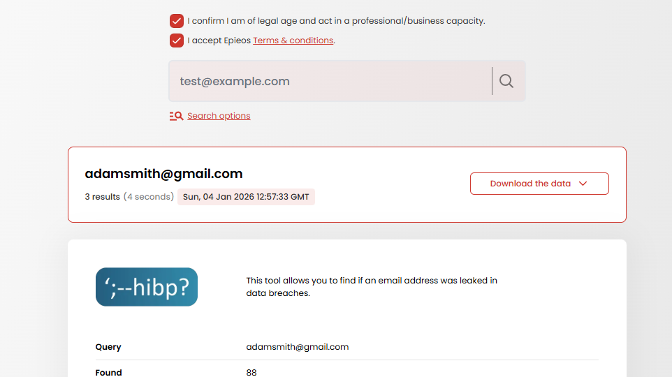
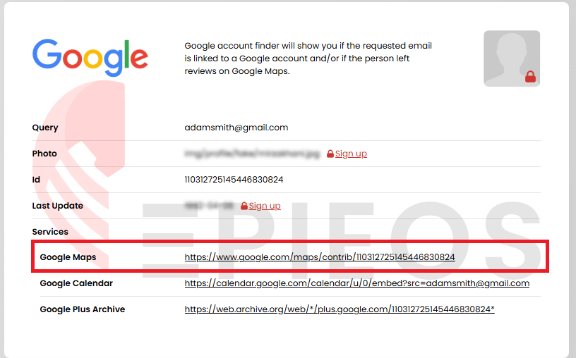

>[!note]
>基礎的OSINT旨在於從單一訊息(姓名、電話號碼、地址、email)開始，進而獲取更多的情報資訊。
# Search Engines
>[!note]
>市面上有大量的不同搜尋引擎，且各有各不同的功用
>

- Surface web: GOOGLE, BING, YAHOO!
- Dark web: AHMIA, DUCKDUCKGO
- Privacy: DUCKDUCKGO, STARTPAGE, QWANT
- Country-specific search engines
- Internet of things (IoT): SHODAN
- Directories: HIDDENWIKI, WIKIPEDIA, SCIHUB, INTERNET ARCHIVE
- Meta-searchengines: FAGAN, DOGPILE
- Imagesearch: TINEYES, YANDEX, LENS

## Google Dorking
>[!note]
>利用Google強大的搜尋能力作為基礎，搭配

- Google Hacking Datrabase : https://www.exploit-db.com/google-hacking-database
### 常用語法
- `inurl` :  限制搜尋結果，規定網頁的 **URL（網址）** 中必須包含指定的關鍵字
``` 
inurl:admin
```
- `intitle` :  限制搜尋結果，規定網頁的 **HTML 標題（Title）** 中必須包含指定的關鍵字。
```
intitle:login
```
- `filetype` :  限制搜尋結果的 **檔案格式**。
```
filetype:php
```
- `site:` :  限制搜尋範圍在特定**網域**或**國家標籤**。
```
site:gov.tw
```
- `intext` :  在**網頁內文**中尋找特定字詞，無視標題或 URL。
```
intext:"password"
```
- `allintext`:  要求網頁內文中必須包含**所有**列出的關鍵字。
```
allintext:admin user pwd
```
- `ext: ` :  `filetype:` 的別名，專門尋找特定的**檔案擴充位元**。
```
ext:log
```
- `filetype` :  搜尋特定副檔名的檔案。
```
filetype:docx
```
### 組合語法
>[!warning]
>可以利用多個語法混在一起使用
- 網址裡有 admin、標題裡有 login、且該檔案是 PHP 程式
```
inurl:admin intitle:login filetype:php
```
- 搜尋包含特定字串的特定副檔名檔案
```
filetype:docx "financial report"
```
- 定位特定國家
```
site:.uk "buy now"
```

##  Google 以外的搜尋選項
- **DuckDuckGo**: Focuses on user privacy and does not track searches.
- **Bing**: Microsoft's search engine that offers unique algorithm responses.
- **Yandex**: Popular in Russia with robust features for language and regional searches.
- **StartPage**: Provides Google search results without tracking users, enhancing privacy.

# Phone Number Lookup
>[!note]
>提供要找一個人手機號碼的一些簡易方法

## 搜尋引擎
>[!note]
>利用`cv`、`resume`等關鍵字，因為有高機率會將手機號碼寫在履歷裡面

```
jason smith phone
```
```
jason smith phone cv
```
```
jason smith phone "cv" OR resume
```
```
"jason smith" "Phone number:" "cv" OR "resume"
```
```
"jason smith" "Mobile number:" "cv" OR "resume"
```
```
"jason smith" "Mobile number:" "cv" OR "resume" ext:pdf
```

## Phone Search Website
- [https://www.ThatsThem.com](https://www.thatsthem.com/)
- [https://www.FreeCarrierLookup.com](https://www.freecarrierlookup.com/)
- [https://www.CarrierLookup.com](https://www.carrierlookup.com/)
- [https://apeiron.io/info](https://apeiron.io/info)
- [https://www.Google.com](https://www.google.com/)
- [https://800notes.com](https://800notes.com/)

## Crowd Sourced Websites
- [www.WhoCalld.com](http://www.whocalld.com/)
- [www.OKCaller.com](http://www.okcaller.com/)
- [www.sync.me](http://www.sync.me/)
- [www.WhoseNo.com](http://www.whoseno.com/)
- [www.TrueCaller.com](http://www.truecaller.com/)
- [www.NumLookup.com](http://www.numlookup.com/)

# People Hunting
>[!note]
>針對人名的調查方式，包含人員情資網站、Email、社群媒體。
## People Search Websites
>[!note]
>如果起始點是一個人名，可以利用以下連結做搜尋。

- [https://FastPeopleSearch.com](https://fastpeoplesearch.com/)
- [https://TruePeopleSearch.com](https://truepeoplesearch.com/)
- [https://AdvancedBackgroundChecks.com](https://advancedbackgroundchecks.com/)
- [https://Radaris.com](https://radaris.com/)
- [https://ClustrMaps.com](https://clustrmaps.com/)
- [https://WhitePages.com](https://whitepages.com/)
- [https://Webmii.com](https://webmii.com/)
- [https://CyberBackgroundChecks.com](https://cyberbackgroundchecks.com/)
## Emails
>[!note]
>如果起始點是Email，可以結合剛剛的尋人網站做搜尋，或是Google那個Email

- Google
```
"target.account@gmail.com"
```
- [www.ThatsThem.com/reverse-email-lookup](http://www.thatsthem.com/reverse-email-lookup)
- [www.Epieos.com](http://www.epieos.com/)
- [https://haveibeenpwned.com](https://haveibeenpwned.com/)
- [https://gravatar.com/site/check/](https://gravatar.com/site/check/)
- [https://PhoneBook.cz](https://phonebook.cz/)

### Example : 利用 Epieos
假設今天要針對 `adamsmith@gmail.com` 做搜尋，嘗試搜尋到這個人的真實身分，我們可以先利用Epieos做搜尋。



在找到相關的Email之後，往下拉可以發現Epieos有蒐集到這個人的Google 帳號相關資訊。



點進連結可以看到這個人在Google Map上面的足跡，並且還有照片、評論、標註之類的資訊。


## Username Enumeration
>[!note]
>當要查找的人只有帳號時，可以嘗試用這些工具做嘗試。

- [https://WhatsMyName.app](https://whatsmyname.app/)
- [https://NameChk.com](https://namechk.com/)
- [https://NameCheckr.com](https://namecheckr.com/)
## Social Media Account
>[!note]
>可以分成用Google 搜尋或是登入社群媒體搜尋
### 使用Google
>[!warning]
>不登入為前提

- Google
```
site:facebook.com OR site:instagram.com OR site:linkedin.com
```


## OSINT List
- [https://inteltechniques.com/tools](https://inteltechniques.com/tools)
- [https://osintframework.com](https://osintframework.com/)
- [https://cipher387.github.io/](https://cipher387.github.io/)
- [https://bit.ly/bcattools](https://bit.ly/bcattools) (Bellingcat)
# Image Searches


